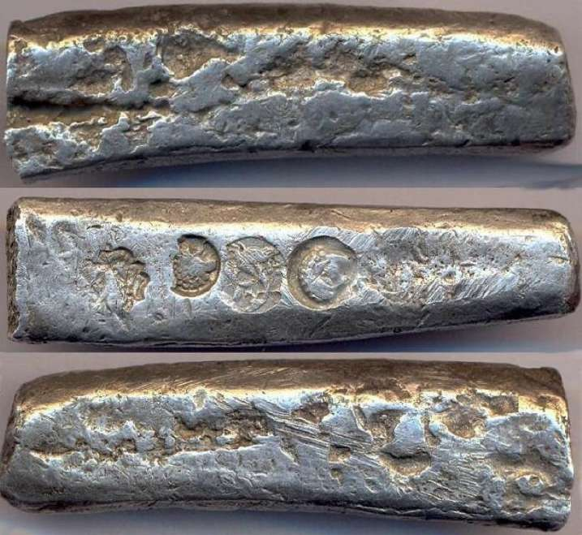
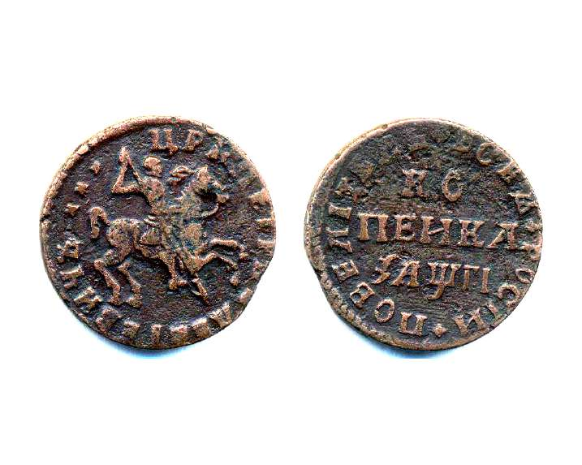
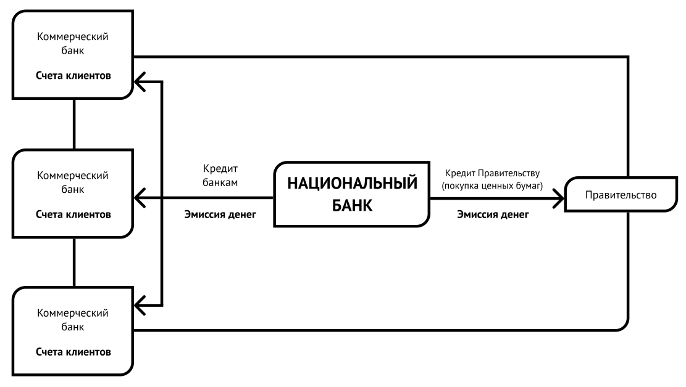
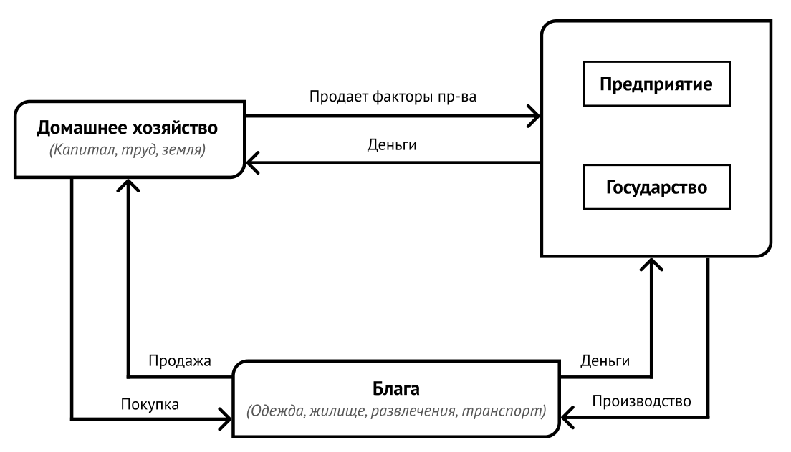

# Урок 1 Откуда взялись деньги и причём здесь финансы?

## Люди никогда не обходились без денег

Одним из самых непонятных социальных феноменов бесспорно являются
деньги. Их образно называют «языком», «кровью», «жиром» общества, и даже
«машиной», приводящей в движение жизнь.

Ответы на, казалось бы, простые вопросы о деньгах не вполне очевидны.
Зачем нужны деньги? Ведь для поддержания жизни человеку необходима лишь
еда, одежда — для защиты от непогоды, и жилье — для укрытия от врагов.
Одному Робинзону на необитаемом острове деньги не нужны совсем. Но, если
после кораблекрушения на острове оказались двое, то деньги уже
становятся важным элементом их отношений.

Почему люди готовы обменивать реальные блага на железные кружочки и
резаную бумагу, не имеющие сами по себе никакой ценности, и даже на
виртуальные токены не обладающие хоть материальной сущностью? Что несут
деньги в общество и его культуру, в цивилизацию в целом? Почему деньги
из средства обеспечения жизни превратились в ее цель? На эти и многие
другие вопросы, касающиеся природы, происхождения и самой сущности денег
общепринятого взгляда нет.

Понятно одно, понимание денег лишь как числа, счетной единицы, которая
обязательна для всех и которой все подчиняются без возражений — является
только особым случаем. Один из авторитетнейших экономистов прошлого века
**Джон Кейнс** вообще считал, что деньги, подобно некоторым другим
элементам цивилизации, гораздо более древнее учреждение, чем нам
предписывается верить, «происхождение их может простираться, когда разум
был волен создавать новые идеи — на островах Гесперид, или в Атлантиде,
или в раю центральной Азии».

Ответы на вопросы о сущности денег неминуемо искать в неизбежности
хозяйства, которое необходимо для развития, защиты и расширения
человеческого социума. Для того, чтобы общество трудилось и развивалось
необходима энергия. Другой энергии, кроме денежной у социума нет.

Жизнь возникает в рождении естественно, дается даром, но люди рождаются
с **потребностью** в еде, потребностью согреться и потребностью в
защите. Потребности человека приводят к его устойчивому спросу на еду,
одежду и жилье.

После удовлетворения жизненных потребностей у человека появляются
**желания,** которые также сильно влияют на его поведение. Комфорт,
стремление выделиться, любовь, путешествия, - это примеры желаний.
Относительная важность желаний по сравнению с потребностями растет по
мере удовлетворения потребностей.

При этом возникает вопрос о том, как общество, состоящее из индивидов,
каждый из которых преследует только свой личный интерес, не приходит к
удовлетворению своих потребностей и желаний за счет элементарного
грубого отнимания благ другу друга силой. Почему люди не отбирают еду и
одежду, а именно цивилизованно обменивают свои навыки и умения на
созданные блага? Ответ — благодаря деньгам.

**В любом, даже самом древнем, обществе имеется ценность значимая для
всех.** И каждый хочет обменять свою человеческую силу, или добытые, или
созданные им продукты на эту общую ценность. Интерес такого обмена
происходит исключительно на основе личностных предпочтений, без
какого-либо принуждения, лишь на основе практики и привычки успешности
таких действий. Такое свободное поведение обменивающихся людей и делает
одного из таких посредников обмена тем, что мы привыкли называть
«деньгами».

Так, в итоге, зачем же нужны деньги? Первая сентенция — роль денег в
создании гуманизма и доверия между людьми. Именно они позволяют
существовать обществу. Именно они выступают посредником между
индивидами. Именно они являются основообразующим институтом, который
придает общественным отношениям форму обмена.

Другое направление мысли о роли денег — разделение людей на сословия и
власти. Общественные отношения должны поддерживаться справедливостью,
которая имеет в виду пропорциональность, но не равенство. Общество
держится на том, что каждому воздается пропорционально его нужности.
Если же пропорция не соблюдена, то невозможны обмены, невозможны
общественные отношения.

Следующий вопрос. Так как же общество выбирает это особенное благо для
своих обменов? Суть в том, что люди всегда хотят иметь что-то,
обладающее рядом свойств, назовем их **«денежные» свойства.** И первое
свойство - «это» не может быть произведено легко, по первому желанию.
Второе, как бы «оно» ни было дорого, и как бы «его» ни было мало,
первоочередное и всеобъемлющее стремление иметь его не может измениться
и вылиться в стремление иметь вместо него что-то другое. И, наконец,
в-третьих, увеличение количества «этого» не создает дополнительных
трудностей и затрат на его хранение.

В результате, в любом, повторимся, хоть в древнейшем, хоть в
современном, обществе появляется приемлемый, гомогенный, делимый,
стабильный, редкий, портативный, долговечный и узнаваемый символ. То
есть, **денежная единица —** знак, обладающий определенными атрибутами.
Поясним немного подробнее.

Денежные знаки должны быть приемлемы всеми,то есть все согласны менять
все именно на них. Также, денежные знаки должны быть гомогенны,
например, каждая единица в один рубль точно такая же, как и другой один
рубль. Кроме того, денежные единицы должны быть делимыми, к примеру,
один рубль на сто копеек. Причем, денежная единица должна иметь
некоторую стабильность ценности, иначе общество выберет другой символ-
единицу, который лучше выполняет денежные функции.

При этом денежный знак должен иметь определенную степень редкости, когда
предложение денежных символов чрезмерно, они теряют свою ценность (с
другой стороны, чрезмерно маленькое количество денежных единиц не даст
возможность людям обменивать свои товары в необходимом количестве). В
добавок денежные знаки должны быть портативны и людям должно быть легко
и удобно переносить их в места, где происходит обмен. Опять же, денежные
единицы должны быть долговечны, они не должны портиться или разрушаться
в короткий период времени. Наравне, денежная единица должна быть
узнаваема — по форме, размеру, цвету. Её содержание должно показывать ее
ценность.

Таким образом, сказать что такое деньги не очень легко. То, что мы
привыкли называть словом «деньги» - это всего лишь конкретные,
появившиеся в результате практики и привычки, максимально
легкореализуемые объекты, причем не имеющие иной ценности, как служить
повсеместно принятым посредником в обменах.

Экономисты говорят о том, что **деньги —** это самое ликвидное благо,
выполняющая в экономических обменах функции, во-первых, измерения
ценности; во-вторых, облегчения обменов; в-третьих, создания средства
платежа (именно это мы называем денежные знаки), и, в четвертых,
сбережения и создания богатства.

При этом действует не только экономика, но и психология, социология и
даже философия денег. Говорят, о денежной энергии, врывающейся повсюду.
Именно энергия денег запускает механизм выбора и делает одно из благ
денежным. Она удерживает порядок, приводя в действие систему зависимости
каждого от всех и всех от каждого. Денежная энергия дает движение всем
социальным процессам и механизмам как для индивидуума, так и для
общества в целом.

## Какими были первые денежные знаки

Строго говоря, для определения посредника в общественных обменах
необходимо использовать не существительное «деньги», а прилагательные,
описывающие свойства, которыми различные блага обладают в различной,
причем меняющейся, степени, например «денежный» или «почти денежный». А
сами деньги, в широком понимании — это бесконечное множество денежных
благ во все времена и на всех территориях.

На древнем этапе развития, когда основной задачей человека было
удовлетворение лишь элементарных потребностей в еде, тепле и защите,
поставщиком денежных знаков была природа, среда жизни человека. Древний
социум для посредника в обменах выбирал предмет, представляющий самую
большую **потребительскую ценность.** Это были, например, яйца, перья,
пшено, рис, соль, сахар, чай, финики, шкуры животных. Затем — мотыги,
бурдюки, циновки, пряжа, лодки, рабы и многое-многое другое.

Позже, в начальные периоды хозяйствования, товаром, обладавшим
наибольшей способностью к сбыту, стал скот. Скот способен достаточно
долго сохраняться, издержки на его содержание всюду, где много лугов,
чрезвычайно малы. Во многих старых языках слово скот и деньги одно и
тоже, например, латинское «pecunia» (деньги) происходит от «pecus»
(скот).

В темные века гомеровского времени (XI-IX вв. до н. э.) еще нет никаких
следов металлических денег. Торговля тогда была преимущественно меновой,
богатство людей составляли стада, платежи производились скотом, им
выражались цены товаров и взимались штрафы. Еще древнегреческий
законодатель Дракон (VII в. до н.э.) штрафы назначает скотом.

## Чем люди расплачивались за товары, пока не изобрели монеты

С развитием человечество с помощью обменов стабильно стало удовлетворять
свои основные потребности выживания -в еде, одежде и крове. И у людей
появились желания — комфорта, процветания, роста благополучия, но самое
главное — желание выделиться. В этот период всеобщей ценностью
становятся вещи, которые способны показать социальную значимость. Это
слоновая кость, янтарь, кварц, нефрит, плитки воска, вино и тому
подобное. Именно эти предметы стали отличаться самой большой
способностью к обмену, важно — хоть непосредственно и не удовлетворяли
физиологические потребности.

Далее, в сознании первобытного человека социальная значимость,
востребованность труда, богатство стало выражалась в количестве
имеющихся у него магических предметов, обладающих, сакральными
свойствами. Денежными знаками становятся талисманы- барабаны, гонги,
бусы, бубенчики и т.п. Позже воплощением аристократического богатства,
стали агальматы (сосуды, статуэтки, картины, рельефы с изображением
божества) - дары, подношения божеству.

Так постепенно самое популярное средство обмена (так называемые
«деньги») приобретает и другие функции — быть показателем значимости,
важности и ценности для группы людей, богатства. Деньги становятся из
средства обеспечения жизни ее целью.

Пока это дело народного обычая, а не власти. Но далее, следующий этап
денежного обращения — около четырех тысяч лет назад **государство
становится монопольным эмитентом и источником денежных знаков.**

## Кто первым начал чеканить монеты из золота и серебра

На определенном этапе, около четырех тысяч лет, назад власть стала
определять статус и ценность денежного знака — предписывать какая вещь
будет считаться денежной единицей. Средство обмена получает
государственную санкцию, что все платежи могут быть произведены только
при помощи этого предмета.

Стоимость сакральных талисманов субъективна и личностна. Она
неустойчива, потому что эти символы ценны только на очень ограниченной
территории, у конкретных кланов. Когда хозяйство становится более
сложным и богатым, выходит за рамки привычной границы, в качестве
посредника в обменах между территориями начинают использоваться металлы.

Из всех металлов выделяется тот, который легко добывается и куется -
медь. Из меди земледелец приготовлял плуги, ремесленник — инструменты. В
ряде цивилизаций денежными знаками служит металлическое оружие.

Но, пользование металлом для обменов сопровождается двумя очень
значительными неудобствами — металл не только трудно взвешивать, но
более сложно определить его качество (пробу). Первая проблема стечением
времени решилась тем, что слитки металлов уменьшились в размере и
изменились в форме до монеты. Решение второй в том, что власть сочла
необходимым отмечать публичным клеймом определенные количества и
качества тех металлов, которые обычно употреблялись при покупке товаров.

Медь раньше других послужила материалом монет. Исторические источники
свидетельствуют о том, что первые монеты появились на рубеже VI11-VII
вв.до н. э. в Лидии на побережье Малой Азии, а несколько позднее начал
чеканить монеты аргосский царь Фейдон на острове Эгина (есть и другие
версии о начале чеканки монет).

Но как только область торгового оборота расширяется, и размеры сбыта
сильно увеличиваются, медь естественным образом теряет свою пригодность
к функционированию в качестве денег. По мере развития культуры деньгами
стали металлы, которые являлись главнейшим средством удовлетворения
самой общей страсти людей, стремления выделиться как-нибудь внешним
образом из среды своих сородичей — серебро и золото.

К концу VII — H34.VI в. до н.э. многие греческие города чеканили свои
монеты. Овцу приравнял драхме,теленка — пяти драхмам в VI в. до н.э.
один из «семи мудрецов» Древней Греции Солон. Изображение скота на
монетах стало символом переоценки ценности. Первые греческие монетные
системы основывались или на статере, или на драхме. На стартере
базировались монетные системы, для которых основным металлом было золото
или электр (сплав золота и серебра), а «серебряные» монетные системы на
драхме.

Так, в архаичное время VIII-VI вв.до н.э.возникли чеканная монета и
государственные учреждения, которые получили название монетных дворов.
Денежные знаки в форме монет окончательно стали иметь отношение к
определенному государству. Государство могло заказать и выпустить в
обращение у монетного двора столько денег, сколько у него было
драгоценного металла.

В древнеримской денежной системе III-I вв.до н.э. важную самостоятельную
роль играли и медные (бронзовые) монеты, и серебряные. Медные
выпускались как разменные, для более ценных, серебряных. Но, во времена
Нерона (I в. н. э.) началось промешивание в монетах к серебру меди.
Зачастую сердцевина монеты была медной и только сверху имелся тонкий
слой серебра.

Номинал денег стал выше стоимости металла, затраченного на его
изготовление. Монета стала иметь внутреннюю и представительскую
стоимость.

Но если уменьшить вес монеты, но оставить прежний номинал, то получится
экономия металла и доход. Такой доход, получаемый от выпуска денег в
обращение за счет разницы между номиналом денег и затратами на
изготовление денежной единицы, стал называться **сеньораж** (фр.
_seigneuriage_ - «власть сеньора, владение сеньора»)

## Как произошло слово монета и откуда взялись «рубль» и «копейка»

Этимология слова означающее «деньги» трудна на любом языке и в
подробностях неясна. В различных языках такое же значение имеют иные
слова: money (анг.), argent (фр.), geld (нем.), dinero (исп.); raha
(фин.); novac (хорв.), penize (чеш.), kassa (швед.); para (тур.), грошi
(укр.); акча (тат.), пул (узб.). На латыни «деньги» - pecunia; на
эсперанто — mono.

В Древней Руси до XI в. в значении «деньги» употреблялось слово «скот»
(«скотница» - казна князя, «скотник» - ее хранитель).

В XI в.термин «скот», равнозначный понятию «деньги», становится
пережитком, и до XII в. в качестве общего значения денег стало
использовалось слово «куна». Предполагается, что оно произошло от слова
«куница», мех которой использовался в славянами в роли денежной единицы.
Однако «куна» созвучно с coin (англ, «монета»), cuneus (лат. «кованный,
сделанный из металла»). Поэтому возможно, что слово «куна» заимствовано
из романских языков.

В XII в. для названия русских металлических денег используется слово
«гривна». Происхождение слова «гривна» точно не установлено; известно,
что это было металлическое (золотое или серебряное) шейное украшение в
виде обруча.

Отрубленный кусок металлической гривны как монеты получил название
«рубль» от слова «рубить». Самое раннее упоминание слова «рубль»
обнаружено в берестяной грамоте, найденной в Великом Новгороде в слое
XIII в. Слово «копейка» появилось гораздо позже,только в XVI в., после
денежной реформы Елены Глинской. На новой монете был изображен всадник с
копьем, за что она получила название «копейной деньги», или «копейки».

Само слово «деньги» в русском языке появилось только в XII-XIV вв. и
оно, несомненно, заимствованное. Существуют предположения о связи
русского слова «деньги» с тюркским damga - «клеймо, штамп, печать» и,
стало быть, с древнерусским тамга - «таможня». Но, вероятнее, что слово
«деньги» занесено на Русь из Ирана, от староперсидского «тенгэ» -
серебряная монета. Афанасий Никитин в «Хожении» (XV век) писал: «а
хоросанцам \<персам> дают алафу \<жалованье> по теньке на день», и там
же встречается «по десяти денег».

Русское слово «монета» стало популярным во времена Петра I. Возможно оно
восходит к арабскому, означающему ценность, отличие. Оно схоже со
словами «подвеска», «знак», «орден». Но, вероятнее, слово монета
произошло от англ, money (деньги) или франц, moneie или monere (совет, в
значении предостережение богини).

Moneta — прозвище римской богини Юноны Советчицы (лат. Juno Moneta).
Считается, богиня Юнона предупредила римлян о близящемся землетрясении и
в затруднительных случаях прибегали к ее предсказаниям (лат. Мопео -
«предвещаю»). По преданию, во время неудачно складывавшегося периода
военных действий в III в. императора Пирра, римляне запросили у Юноны
совета о том, где добыть средства на ведение войны. Жрецы богини уверили
народ, что средства найдутся, если войну вести справедливо. Предсказание
сбылось, война была выиграна, и римляне в знак благодарности на
территории храма Юноны Монеты разместили мастерские для чеканки денег,
на которых делалось ее изображение и надпись «Монета». Такие деньги и стали называть монетами. Впоследствии термин был распространен на все виды металлических денег.

## Как появились бумажные деньги и зачем

История денег всегда соседствует с историей сбережений. Поскольку монету
легко украсть, люди начали оставлять их (и другие ценности) на хранение
ювелирам, имевшим безопасные хранилища. Люди стали получать взамен
сданных на хранение монет складские расписки, то есть свидетельства о
депозите денег у ювелира.

Для умножения количества монет требуется реальное количество золота и
серебра. Начиная с X в. в Китае, и, гораздо позже, в XIII в. в Европе
из-за нехватки золотых монет люди охотно стали использовать в обменах не
монеты, а долговые расписки — обещания ювелиров выплатить предъявителю
определенную сумму монет. Эти обязательства ювелиров-менял, обещающие
обменять долговую расписку на металлическую монету, и были первыми
бумажными деньгами.

Важный момент. Сами долговые расписки на камнях, дереве и пергаменте
известны со времен древнейших цивилизаций. Но, но использование расписок
именно как денежных знаков получило распространение только в средние
века, когда государство стало видеть свою роль, интерес, возможность
регулирования и контроля этого явления. При этом, принципиально, что **с
появлением бумажных денежных знаков власть утрачивает свою
исключительную привилегию выпуска в обращение, то есть предложения
денег.**

## Как появились банки

Металлические деньги слишком тяжелые. Из перевозка трудна и опасна. С
хранением монету менял-ювелиров торговцами стало гораздо удобнее
производить между собой расчеты. Денежных дел мастера по просьбе
вкладчиков в своих учетных книгах просто переписывали свои долги со
счета одних на своих клиентов счета других. Это устраняло неудобства
перевозки, оценки, подсчета разнообразной монеты.

В Италии, места, где происходили обмены бумажных сертификатов на монеты
и наоборот, получили название **банк** (от итал. banco — скамья, стол,
прилавок, сундук, порытый зеленым сукном, на которых менялы раскладывали
монеты). Ювелиры-менялы стали называться банкирами (итал. banchiere).

У банков появился излишек монет, которые переданы им на хранение, но не
востребованы клиентами. Почему? Платить комиссию банкиру необходимо и
при вкладе на хранение, и при получении обратно монет. Поэтому проще и
дешевле рассчитаться друг с другом банковскими обязательствами
(бумажными банковскими нотами — банкнотами, англ, bank notes). Банкиры
стали выдавать в ссуду не только свои, но и принятые на хранение, но не
востребованные монеты. Появились депозитно-кредитные отношения. Банки
принимают деньги на хранение и платят за это вкладчикам определенный
процент. И эти принятые деньги, за более высокий процент, дают в долг.

Впоследствии ссуды стали выдавать не только монетами, но и банковскими
расписками. Появились мошенники. Кредитов выдавали больше, чем принято
на хранение монет. Если у вас была расписка о долге банкира 10 лир, то
при условии, что банкир в принципе платежеспособен, эта расписка сама по
себе обменивалась на золотые 10 лир. С уменьшением авторитета банкира
снижался и обменный курс расписки на реальные монеты. Когда менялу
уличали в обмане, его сундук переворачивали и ломали в поисках золотых
монет. Так произошло понятие банкротство — разорение, приводящее к
несостоятельности (от итал. banca rotta — перевернутая скамья).

Первоначально банкирами во всей Западной Европе были исключительно
итальянцы. Одна лишь Англия в истории банкирского дела не следовала по
этому пути. Там размен денег, а значит и выпуск в обращение бумажных
долговых расписок издавна была предметом государственной монополии.
Власть лишь давала право банкирам на выпуск в обращение определенного
количества своих обязательств.

## Что значит деньги обеспечены золотом

Банковское дело ширилось. Уже государство стало хранить свои сбережения
в самых крупных банках, которые стали называться национальными или
центральными. Старейшим из ныне существующих национальных банков
считается шведский Риксбанк, основанный в 1668 г. И государство также
взамен своего золотого запаса стало получать долговые банковские
расписки и рассчитываться ими по своим государственным обязательствам.

Постепенно государство отказывается от оплаты своих обязательств
металлической монетой. Государственные расчеты стали производиться
только бумажными государственными расписками (билетами) -
свидетельствами о том, что предъявитель может в национальном банке
получить указанное количество монет.

И далее, власть начала выпускать столько денежных билетов, сколько ей
было нужно, без строгой привязки к количеству золота, хранящемуся в
национальном банке. В результате бумажные деньги стали обмениваться на
монеты по заниженному курсу, например, ассигнация на десять монет
обменивалась лишь на три монеты серебром.

Стечением времени бумажные денежные знаки вовсе перестали обмениваться
на золотые монеты сначала формально, а затем и фактически. Это случилось
в 1970-хх годах. Экономисты по этому вопросу говорят, что в конце XX в.
закончился «золотой денежный стандарт», то есть «привязка» денежных
знаков к золоту, или обязательства государства обменивать банковскую
ноту (банкноту), бумажное банковское обязательство на металлическую
монету.

Нобелевский лауреат по экономике Милтон Фридмен иронизирует по этому
поводу, что сейчас количество денег полностью определяется усмотрением
власти, которая даже не «втирает очки» (в оригинале: «does not even pay
Lip service) связью денег с каким-либо товаром. Упоминавшийся нами Джон
Кейнс такую денежную систему остроумно назвал «фиатной» (декретной, от
лат. fiat — пусть будет).

В настоящее время для эмиссии или, другими словами, выпуска в
национальных денежных единиц и регулирования денежной массы в каждом
государстве создается специальный независимый финансовый институт -
Национальный или, как его иногда называют, Центральный банк.
Независимость национального банка проявляется в организационном,
финансовом и политическом аспектах.

-   Организационно национальный банк является самостоятельной
    организацией. Он не входит структурно в какой-либо другой
    государственный институт.

-   Национальный банк не отвечает по обязательствам Правительства,
    Правительство не отвечает по обязательствам национального банка.
    Национальный банк не отвечает по обязательствам других финансовых
    институтов, финансовые институты не отвечают по обязательствам
    национального банка.

-   Национальный банк не имеет формальных связей с другими органами
    государственной власти. Государственная власть не имеет права
    изымать средства и имущество национального банка без его согласия.

Таким образом, современные денежные единицы эмитируются Национальными
банками путем кредитования счетов коммерческих банков, *(см. рисунок)*

Количество, или спрос на деньги, определяется коммерческими банками. Они
выдают кредиты за счет привлеченных депозитов, но если кредитов выдано
больше, чем привлечено депозитов, то банки обращаются за средствами в
центральный банк, который дает деньги в долг коммерческим банкам. Так
происходит рост денежной массы. Существует определенная зависимость
между привлеченными банками вкладами и ростом денежной массы. Она
называется депозитно-кредитный мультипликатор.

Также на денежную массу влияют национальные Правительства. Формируя
государственный бюджете дефицитом, они вынуждены занимать деньги. Что в
итоге выливается опять-таки в спрос на деньги у национального банка.

## Какая покупательная способность современных денег

Современные денежные единицы иронично называются фиатными. Они не
конвертируемы во что-нибудь, кроме самих себя, и не имеют фиксированной
ценности в плане реального обеспечения ни золотом, ни нефтью ни чем
другим кроме доверия к ним.

То есть, в восприятиях современный действительный денежный стандарт
(эйдос денег) - это соглашение между национальным банком, обществом и
государством. Национальный банк обязуется принимать в качестве средства
платежа что-то, выпущенное им в обращение. Государство обеспечивает в
обществе использование в качестве средства платежа только то, что
выпустил национальный банк. То есть сущность современных денег
заключается в том, что они являются имуществом (активом) потому, что это
обязательство (пассив) национального банка.

Эволюция форм денег не закончилась. На смену фиатным деньгам приходят
тайные (крипто) деньги, за которыми вероятно будущее. Криптовалюты -
суть майнинговое (полученное, добытое) комиссионное вознаграждение от
всемирной сети за блокчейн — учет проведенных в ней же цепочек платежных
транзакций.

Мы сейчас находимся только в начале неизведанного пути к криптовалютами.
На новом пути всегда много неуверенности и эксперимента, процесс
изучения современной денежной системы далек от окончания.

## Что такое финансы

Слово финансы в быту часто используется для обозначения денег. На самом
деле, это не так, хотя без денег не может быть и финансов. Деньги — это
основа существования и функционирования финансов.

Финансы — это управление деньгами. Финансы — это экономические
отношения, связанные: во-первых, с формированием денежных фондов,
во-вторых, с распределением, и, в-третьих, с контролем эффективности
использования денег.

Финансовая система представляет собой совокупность трех сфер отношений,
характеризуемых особенностями в формировании, распределении и
использовании денежных средств, а также ролью в общественном
воспроизводстве. Это (1) государственные финансы, (2) финансы
предприятий и (3) финансы домашних хозяйств. Государственные финансы
иногда называют «публичными», а финансы предприятий и домашних хозяйств
- «частными».

-   **Публичные (государственные) финансы.** Из главной задачей является
    концентрация денежных средств в распоряжение государства и
    направление их на финансирование государственных нужд. Они
    формируются за счет налогов, сборов, пошлин, доходов от
    государственной собственности.

-   **Корпоративные финансы (предприятий).** Главной их задачей является
    формирование денежных фондов для предприятия и использование их для
    производственной деятельности.

-   **Личные финансы (домохозяйств).** Это формирование доходов и
    расходование их, во-первых, на текущее потребление и приобретение
    личного имущества, во-вторых, создание «подушки безопасности»,
    откладывание денег «на черный день», на «всякий случай», и, в
    третьих, инвестирование временно свободных денег с целью получения
    дохода и сохранения от инфляции.

## Финансовая система

Домашние хозяйства являются собственниками факторов производства (земля,
труд, капитал, предприимчивость). Продавая эти факторы предприятиям и
государству, домашние хозяйства получают доход, который позволяет им
покупать производимые продукты, осуществлять сбережения, проводить
инвестиции.

Предприятия и государство получают выручку (деньги от домашних
хозяйств). Полученная выручка позволяет им вновь покупать у домашних
хозяйств их факторы производства.

Домашние хозяйства, получая деньги за свои факторы производства идут их
тратить, вновь передавая средства предприятиям и государству. Последние
обменивают полученные деньги на факторы производства других людей (в
качестве платы своим сотрудникам). Эти деньги домашние хозяйства опять
обменивают на товары, работы и услуги и так далее.

Финансовая социальная система работает. Для этого ей нужна основа -
«смазка», «кровь», «жир» или «энергия»,то есть деньги.

