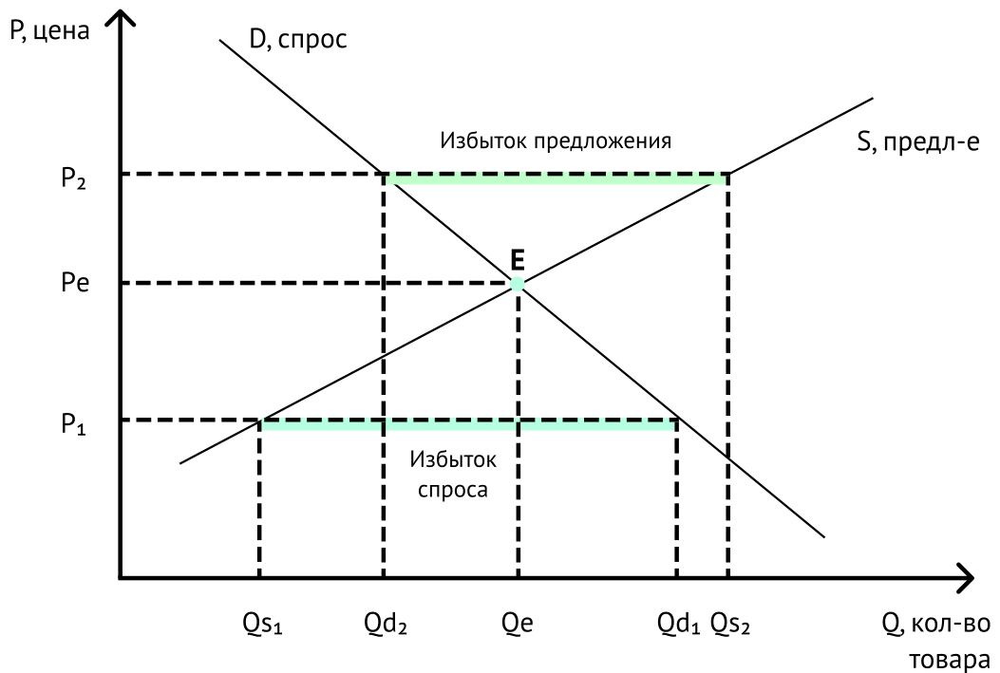
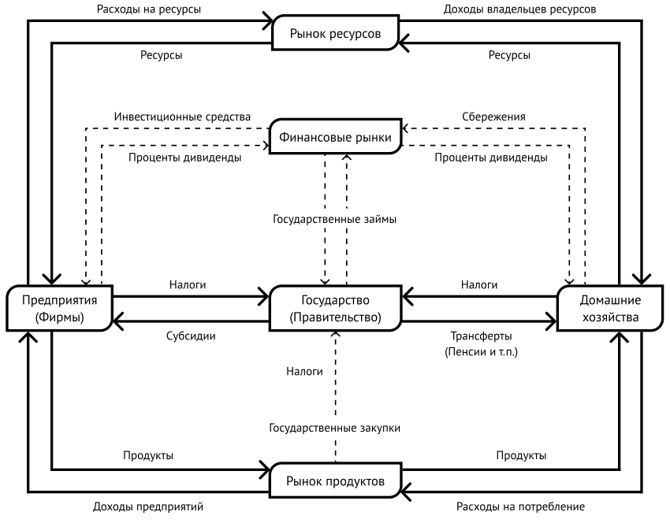
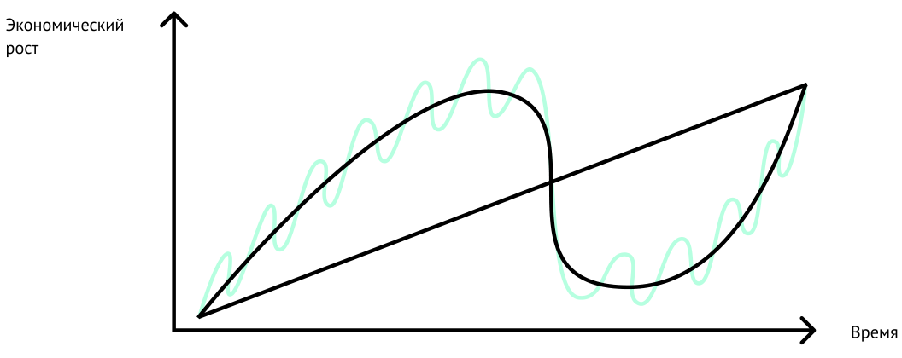

# Урок 2 Экономика

## Экономика и факторы производства

Что такое экономика? Само слово «экономика» происходит от
древнегреческих οἶκος «дом, хозяйство» и νομος «правило, закон» и
буквально означает «правила ведения домашнего хозяйства».

Экономика — это система производства и распределения товаров и услуг,
предопределяющая вопрос «кто получает что». Экономика размещает ресурсы
общества и распределяет полученный общественный продукт, развивает
производство и потребление товаров и услуг, оценивает эффективность
хозяйствования. Экономика складывается из миллионов людей, которые
осуществляют различные виды деятельности: покупку, продажу,
производство, финансовые операции и т. д.

Необходимость развития, защиты и расширения социума вызывает
непременность хозяйства. Жизнь возникаете рождении естественно, дается
даром, но люди рождаются с **потребностью** в еде, потребностью
согреться и потребностью в защите. Потребности человека приводят к его
устойчивому спросу на питание, одежду и жилье.

Кроме, потребностей у человека со временем появляются **желания,**
которые также сильно влияют на его поведение. Комфорт, стремление
выделиться, любовь, путешествия, это примеры желаний. Относительная
важность желаний по сравнению с потребностями растет по мере
удовлетворения потребностей.

Вся совокупность отношений общества, позволяющих производить и
приобретать блага, поддерживающие жизнь, удовлетворяющие потребности и
желания и есть хозяйство. В основе хозяйства лежит экономическое
поведение.

Экономическое поведение предполагает обмен одного редкого,
недостаточного ресурса на другой. Люди обменивают свой труд, то есть
имеющееся у них такое дефицитное время, силу и навыки на доход. Затем,
они обменивают полученный и всегда дефицитный доход на тоже дефицитные,
но необходимые или желаемые товары и услуги. Возникают экономические
обмены. При этом, уже понятно, что составляющими экономической
активности являются два процесса. Это потребление и производство.

**Потреблением** называется процесс удовлетворения потребностей и
желаний. Как отмечалось, это стимулируют человека к обмену имающихся у
него его физической силы, навыков и умений, принадлежащих ему земли и
природных ресурсов, созданных им машин и оборудования — на какую-то
общепринятую ценность. А затем — к обмену этой ценности на продукты для
поддержания жизни или, позволяющие ему выделиться, обрести силу, власть
или комфорт.

Эти ценные для людей продукты надо создать. Процесс создания товаров и
услуг в условиях использования ограниченности ресурсов называется
**производство.** Производитель обменивает получаемые им ценности
(доход) на необходимые им для производства дефицитные ресурсы.

Таким образом, суть экономических обменов в том, что обе экономические
стороны, и производители, и потребители, обменивают то, что у них есть,
на то, что хотят другие. Потребители имеющиеся у них дефицитные ресурсы
на общепринятую ценность, а производители имеющуюся дефицитную ценность
на дефицитные ресурсы.

Редкие ресурсы, которые являются основой экономических обменов — это
земля, труд, капитал и предприимчивость. Они называются **факторами
производства.**

- **Земля.** Это не только часть суши, на которой непосредственно
  расположено производство. Также дефицитным ресурсом являются находящиеся
  в земле полезные ископаемые, прежде всего металлы и углеводороды, и
  окружающая землю среда воздух, вода, флора и фауна.

- **Труд** (человеческий капитал). Это ценность физической силы
  человека, его навыков и умений, доступных экономике.

- **Капитал** (реальный капитал). Если считать активом всё, что приносит
  доход, а пассивом — всё, что влечёт за собой расход. То капитал — это
  активы, не являющиеся природными, которые были специально созданы для
  производства. Капитал включает машины и оборудование, запасы сырья и
  денежных средств, ожидающие использования, прежде чем они станут
  товарами и услугами. Создание капитала называется инвестированием.

- **Предприимчивость.** Это желание, способность и готовность к созданию
  и применению новых необычных способов достижения чего-либо, прежде
  всего, для получения дохода. Предприниматели создают предприятия,
  которые выполняют две важные роли: во-первых, сочетают факторы
  производства так, чтобы производились товары и услуги наиболее
  эффективным способом; и во-вторых, принимают на себя риски, связанные с
  потенциальной потерей факторов производства.

Экономические операции: рациональность и выбор, полезность и
недостаточность, спрос и предложение, цена

Экономисты полагают, что люди **рациональны.** Они **выбирают**
наилучший образ действий, исходя из их знаний в конкретных
обстоятельствах. Например, стараются получить лучшее соотношение цены и
качества, а также выбирают определенное экономическое поведение, меняют
направления расходов в зависимости от обстоятельств.

У каждого товара и услуги есть определенная цена, потому что существует
две силы: они **полезны** и их **недостаточно.** О полезности
свидетельствует тот факт, что они требуются потребителям. В полностью
населенном вегетарианцами поселке мясо никогда не будет иметь никакой
цены, как бы мало коров или овец ни было. Недостаток же проявляется в
невозможности предоставлять неограниченное количество товаров.

Конкретная цена любого товара определяется на рынке именно этого товара.
Полезность становится очевидной благодаря потребительскому спросу на
него, а недостаток товара становится очевидным по объему его
предложения. **Спрос** — это количество товара, которое потенциальные
покупатели готовы купить по определенной цене. **Предложение** — это
количество товара, которое существующие или потенциальные производители
готовы поставить по данной цене. **Цена** определяется точкой
пересечения спроса и предложения.

На рисунке можно увидеть графическое отображение линий спроса (D — от
англ, «demand») и предложения (S — от англ, «supply»). Нисходящий наклон
линии D определяется тем, что с возрастанием цены покупатели готовы
приобретать меньшее количество товара. А восходящий наклон линии S тем,
что производители, наоборот, готовы продавать больше. Пересечение линий
спроса и предложения в точке Е (от англ, «equilibrium») определяет
количество товара (Ое), которое может быть реализовано по определённой
цене (Ре). Состояние рынка в точке Е является равновесным, т. к.
количество спроса равно количеству предложения. То есть ни у
потребителей, ни у производителей нет побуждения к изменению данного
баланса.

В случае понижения цены с Ре до Pi на рынке возникает избыток спроса,
(объём спроса (Qs1) больше объёма предложения (Qd1), то есть
производители готовы продавать большее количество товара, чем то,
которое готовы приобретать покупатели. В случае повышения цены до уровня
Р2 — избыток предложения, т. к. объём предложения Os2 больше объёма
спроса Od2. В обоих случаях, рынок будет стремиться вновь к состоянию
равновесия. Одним из инструментов достижения равновесного рыночного
состояния является конкуренция.

> _Рис._ Взаимодействие спроса и предложения. Равновесие.

## Конкуренция, типы рыночных структур

В зависимости оттого, в какой степени участники рынка находятся в
отношениях конкуренции, рынки подразделяют на несколько типов:
совершенная конкуренция, монополистическая конкуренция, монополия и
олигополия. Далее мы разберём данные типы рыночных структур по следующим
параметрам: количество и размер фирм-продавцов, возможность отдельной
фирмы повлиять на рыночную цену, тип товара, барьер для входа на рынок,
доступность рыночной информации и вид конкуренции.

Остановимся подробнее на последнем параметре. Конкуренция может быть
ценовая и неценовая. В первом случае фирма обладает способностью влиять
на рыночную цену. Во втором — влияние фирмы на рыночную ситуацию
возможно только путём неценовых инструментов (изменение качества или
вида товара, реклама, сервис и пр.).

В экономике существует идеализированный образ конкуренции -
**совершенная конкуренция,** при которой рынок организован таким
образом, что ни один участник (в одиночку) не может повлиять на цену
продукции. На рынке действует очень большое количество мелких
фирм-продавцов и покупателей. Предлагаемая продукция однородна. Барьеры
для вхождения на рынок практически полностью отсутствуют.

В реальной жизни совершенная конкуренция встречается крайне редко. Но в
качестве примера можно представить образ рынка сельскохозяйственной
продукции. Предположим, что на этом рынке множество фермеров торгуют
одним видом овощей. Товар обладает одинаковым качеством, все продавцы в
равной степени осведомлены о ситуации на рынке (спрос, конкуренты, цены
и т. д.), процесс торговли можно начать и прервать в любой момент. У
продавца нет абсолютно никакой возможности установить желаемую цену, так
если она будет выше рыночной, то его продукцию не купят — слишком много
конкурентов. И договориться совместно о более высокой цене тоже
невозможно — конкурентов слишком много.

В современной ситуации, примером совершенной конкуренции может считаться
рынок, на котором продаются и покупаются иностранные валюты. Например,
доллары за рубли, евро за доллары и т. д.

Второй тип рыночной структуры — **монополистическая конкуренция.** На
рынке действует большое количество мелких и средних фирм, они предлагают
дифференцированный, но не полностью взаимозаменяемый тип продукта.

Фирмы в незначительной степени могут контролировать цену, при этом на
рынке присутствует жёсткая неценовая конкуренция. Барьеры для вхождения
на рынок легко преодолимы. Доступ к рыночной информации обладает
незначительными ограничениями.

В качестве примеров можно привести рынки пищевой промышленности,
общественного питания, одежды, обуви, бытовой техники и пр. Покупатель
приобретает товар на основании личных предпочтений, качества, наличия
определённых функций у продукта, условий сервиса и гарантийного
обслуживания. При этом, если его не устраивает цена, то он с лёгкостью
может найти замену. В реальной жизни монополистическая конкуренция
является самым распространённым типом рыночной структуры.

**Олигополия** — рыночная структура, подразумевающая наличие небольшого
количества крупных продавцов, которые могут предлагать как однородный,
так и дифференцированный товар. Иными словами, значительная доля рынка
находится под властью нескольких крупных компаний, которые, конкурируя
между собой, создают серьёзные барьеры для входа на рынок. Ценовая
конкуренция ограничена взаимозависимостью продавцов. Неценовая
конкуренция типична при дифференцированном продукте. Рыночная информация
представлена в ограниченном доступе. Примеры олигополии — рынок
пассажирских самолётов, рынок мобильной связи.

**Монополия** — рыночная структура, характеризующаяся наличием одного
единственного продавца, который предлагает уникальный товар. Компания
полностью контролирует рынок, цену. Барьеры для входа на рынок
практически непреодолимы. В качестве примеров можно привести рынок
транспортировки полезных ископаемых; эксплуатацию железнодорожной инфраструктуры.

## Экономическая модель

Всех участников экономических отношений принято называть
**экономическими агентами** и разделять на группы: домашние хозяйства,
предприятия и государство.

- Домашнее хозяйство является собственником и поставщиком факторов
  производства, одновременно выступая основным потребителем экономических
  благ. Домашние хозяйства к удовлетворению потребностей, максимизации
  благосостояния.

- Предприятие преобразует факторы производства в товары и услуги.
  Предприятия стремятся к максимизации прибыли.

- Государство регулирует и контролирует взаимоотношения между другими
  экономическими агентами. Отличительной чертой государства является
  стремление к максимальному удовлетворению потребностей всего общества.
  Государство стремится к максимизации общественного благосостояния.

В экономике государство осуществляет сбор ресурсов экономических агентов
в виде прямых и косвенных **налогов.** Прямые налоги выплачиваются
непосредственно самим агентом, например, для домашних хозяйств это
подоходный налог и различные социальные взносы; для предприятий — налог
на прибыль. Косвенные налоги выплачивают предприятия и включают их в
цену товара или услуги, например, это сборы и пошлины. Большую часть
бремени налогов несет домашнее хозяйство.

Также, государство осуществляет и обратный экономический процесс -
осуществляет расходы в интересах всего общества, выплачивает дотации
предприятиям, субсидии, пенсии, стипендии и другие социальные пособия
домашним хозяйствам.

На рисунке представлена модель организации экономики. Все виды
экономических агентов являются участниками финансовых рынков. Мы видим
непрерывную взаимосвязь между всеми экономическими агентами.

Домашние хозяйства, получая доход, либо направляют его на удовлетворение
потребностей, либо сберегают его, становясь участниками финансовых
рынков. Сбережения могут быть в виде банковских вкладов, инвестиций в
различные фонды, например, пенсионные и другие. Взаимодействуя с
финансовым рынком, домашнее хозяйство получает обратную связь в виде
доходов от своих вложений. Предприятия, взаимодействуя с финансовыми
рынками, приобретают инвестиционные средства, за которые впоследствии,
погашая задолженность, выплачивают проценты. Государство также может
заимствовать средства на финансовых рынках для совершения необходимых
ему закупок. Погашая задолженность, государство выплачивает проценты.

> _Рис._ Модель экономики

Двигаясь к своей цели, каждый из экономических агентов отвечает на
вопросы: какую полезность принесет последующая потребленная единица
продукции? На сколько увеличится выпуск при увеличении используемого
ресурса на единицу? Принесёт ли это увеличение выпуска доход? И как
увеличатся затраты?

Это называется принципом предельного анализа. Работая с предельными
экономическими показателями, агент может принять рациональное
экономическое решение.

Приведем примеры. Дополнительная польза от потребления еще 1 ед.
продукции — предельная полезность. Дополнительный выпуск товара,
связанный с увеличением используемого ресурса на 1 ед. — предельный
продукт.

Дополнительный доход, связанный с увеличением выпуска продукции на 1 ед.
- предельный доход. Дополнительные затраты, связанные с увеличением
производства товара на 1 ед. — предельные затраты.

Наращивание производства товаров и услуг обращает нас к важнейшему
понятию экономики — **экономическому росту.** Основной мерой
экономического роста является увеличение показателей ВВП (валовый
внутренний продукт) и ВНП (валовый национальный продукт). ВВП есть
стоимость всех произведённых благ на территории страны. ВНП — стоимость
всех произведённых благ только гражданами страны, но находящимися как
внутри её, так и за её пределами. Измерение экономического роста
рассчитывается на основе сопоставления как роста абсолютных значений ВВП
и ВНП за определённый промежуток времени (как правило, год), так и роста
ВВП и ВНП на душу населения.

Экономический рост не может быть постоянным и равномерным. Время от
времени он сменяется экономическим кризисом. Колебания экономической
активности, состоящие из повторяющихся экономических спадов и подъемов,
называются **экономическим циклом.**

Циклы состоят из фаз роста (оживление и подъем) и спада (кризис и
депрессия). Различаются циклы природой своего возникновения. Экономисты
различают краткосрочные (5--10 лет) и долгосрочные экономические циклы
(считается, что в среднем, раз в 50 лет происходит обновление всей
экономической системы, и начинается повышательная фаза долгосрочного
цикла), *(см. рисунок)*

> _Рис._ Экономические циклы

Краткосрочная экономическая цикличность задается тем, что кредит создаёт
обязательство выплатить его в будущем. То есть получая актив в настоящее
время мы будем вынуждены в будущем потратить меньше, чем заработаем.

Фаза подъема в краткосрочном цикле сопровождается экспансионистской
денежной политикой ростом денежной массы, что приводит к увеличению
расходов на товары и услуги потребителями. Поскольку затраты одного
экономического агента есть доходы другого — рост экономики очевиден. Но
это неизбежно ведёт к инфляции (увеличению цен), так как. экономика не
успевает производить столько, сколько требует спрос. Это приводит к
тому, что центральный банк начинает проводить рестриктивную денежную
политику, направленную на сокращение количества денег и уменьшения
инфляции. Потребление снижается и цикл идёт на спад.

В долгосрочном экономическом цикле на стадии спада центральный банк уже
не в состоянии значительно влиять на спрос и предложение денежной
политикой. Снижение трат и доходов экономических агентов, повышает
уровень безработицы и социальной нестабильности — происходит
экономический кризис.

## Социально-экономическая политика

Экономическая политика — это политика государства, обращенная к
экономической системе: определение целей и перспектив ее развития, выбор
и создание средств достижения целей. Современная экономическая политика
базируется на четырех тезисах.

1. Экономическая мощь государства определяется экономической мощью
   частного сектора, ядро которого составляют крупные корпорации. Частный
   сектор — это части экономики, не находящаяся под контролем
   государства;

2. Вмешательство государства в деятельность частного сектора
   минимально;

3. Основным источником финансирования, определяющим возможности
   развития крупных корпораций, являются прибыль и рынок капитала. Рынок
   капитала — это финансовый рынок, на котором, с одной стороны, частные
   лица и организации могут разместить (инвестировать) временно свободные
   денежные средства, а с другой — частные предприятия и государственные
   структуры могут получить денежные средства на длительный срок для
   финансирования своих проектов.

4. Интернационализация, то есть адаптация к языковым и культурным
   особенностям рынков товара, труда и капитала, приводит сближению
   (экономической интеграции) государств.

Экономическую политику нельзя ставить в один ряд с другими направлениями
— социальной, военной, внешней, культурной политикой и другими.
Экономика пронизывает все сферы общества и его жизни, поэтому
экономическая политика неразрывно связана со всеми перечисленными
направлениями. Поэтому правильнее говорить о **социально-экономической
политике.**

Элементами социально-экономической политики являются установление
прожиточного минимума, социальных пособий, пенсионное обеспечение,
регулирование занятости и безработицы, охрана труда, продолжительность
рабочего дня, регулирование трудовой миграции и прочее.

Прожиточный минимум — один из самых значимых элементов
социально-экономической политики. Это стоимость минимальной продуктовой
корзины и непродовольственных товаров и услуг, которые необходимы
человеку для поддержания его жизнедеятельности. Прожиточный минимум
является «чертой бедности», оказавшись за которой, семью или индивида
можно признать малоимущими.

Важнейший инструмент социально-экономической политики финансовая
политика. Финансовая политика — это определение целей и обеспечение
финансовыми ресурсами непрерывного экономического процесса для решения
экономических задач общества.

Финансовая политика многогранна и осуществляется по целому ряду
взаимосвязанных направлений. Среди них чаще всего выделяют две главных
линии: монетарную и фискальную политику.

**Монетарная** (денежно-кредитная) политика — совокупность финансовых
мероприятий национального или, иногда его называют центрального, банка
финансового института, регулирующего предложение, спрос и стоимость
денег. Монетарная политика — это, в первую очередь, управление объемом
денежной массы, уровнем инфляции и обменным курсом национальной валюты.

**Фискальная** (бюджетно-налоговая) политика — совокупность финансовых
мероприятий государства по регулированию правительственных доходов и
расходов. Фискальная политика — это политика государства в области
налогов.
